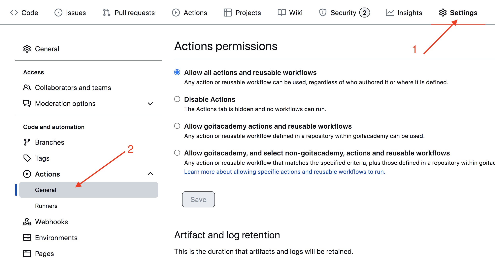

# goit-js-hw-09

=======

## Домашнє завдання

- Проект зібраний за допомогою
  [**parcel-project-template**](https://github.com/goitacademy/parcel-project-template).
- [**Завантажуй стартові файли**](https://minhaskamal.github.io/DownGit/#/home?url=https:%2F%2Fgithub.com%2Fgoitacademy%2Fjavascript-homework%2Ftree%2Fmain%2Fv2%2F09%2Fsrc)
  з готовою розміткою, стилями та підключеними файлами скриптів для кожного
  завдання. Скопіюй їх собі в проект, повністю замінивши папку `src` у
  [**parcel-project-template**](https://github.com/goitacademy/parcel-project-template).

### Task #1

`Перемикач кольорів`

Виконуй це завдання у файлах `01-color-switcher.html` і `01-color-switcher.js`.
[**Демо-відео**](https://user-images.githubusercontent.com/17479434/127716753-fabd276f-6a7d-411b-bfa2-01c818f4ea66.mp4)
роботи перемикача

HTML містить кнопки «Start» і «Stop».

```html
<button type="button" data-start>Start</button>
<button type="button" data-stop>Stop</button>
```

Напиши скрипт, який після натискання кнопки `«Start»`, раз на секунду змінює
колір фону `<body>` на випадкове значення, використовуючи інлайн стиль.
Натисканням на кнопку `«Stop»` зміна кольору фону повинна зупинятися. Враховуй,
що на кнопку `«Start»` можна натиснути нескінченну кількість разів. Зроби так,
щоб доки зміна теми запущена, кнопка `«Start»` була неактивною (disabled). Для
генерування випадкового кольору використовуй функцію `getRandomHexColor`.

```js
function getRandomHexColor() {
  return `#${Math.floor(Math.random() * 16777215)
    .toString(16)
    .padStart(6, 0)}`;
}
```

### Task #2

`Таймер зворотнього відліку`

Виконуй це завдання у файлах `02-timer.html` і `02-timer.js`. Напиши скрипт
таймера, який здійснює зворотний відлік до певної дати. Такий таймер може
використовуватися у блогах та інтернет-магазинах, сторінках реєстрації подій,
під час технічного обслуговування тощо.
[**Демо-відео**](https://user-images.githubusercontent.com/17479434/127672390-2a51efe1-06fb-41dd-86dd-8542393d3043.mp4)
роботи таймера.

#### Елементи інтерфейсу

HTML містить готову розмітку таймера, поля вибору кінцевої дати і кнопку, по
кліку на яку, таймер повинен запускатися. Додай мінімальне оформлення елементів
інтерфейсу.

```html
<input type="text" id="datetime-picker" />
<button type="button" data-start>Start</button>

<div class="timer">
  <div class="field">
    <span class="value" data-days>00</span>
    <span class="label">Days</span>
  </div>
  <div class="field">
    <span class="value" data-hours>00</span>
    <span class="label">Hours</span>
  </div>
  <div class="field">
    <span class="value" data-minutes>00</span>
    <span class="label">Minutes</span>
  </div>
  <div class="field">
    <span class="value" data-seconds>00</span>
    <span class="label">Seconds</span>
  </div>
</div>
```

#### Бібліотека flatpickr

1. Використовуй бібліотеку [**flatpickr**](https://flatpickr.js.org/) для того,
   щоб дозволити користувачеві кросбраузерно вибрати кінцеву дату і час в одному
   елементі інтерфейсу. Для того щоб підключити CSS код бібліотеки в проект,
   необхідно додати ще один імпорт, крім того, що описаний в документації.

```js
// Описаний в документації
import flatpickr from 'flatpickr';
// Додатковий імпорт стилів
import 'flatpickr/dist/flatpickr.min.css';
```

Бібліотека очікує, що її ініціалізують на елементі `input[type="text"]`, тому ми
додали до HTML документу поле `input#datetime-picker`.

```js
<input type="text" id="datetime-picker" />
```

Другим аргументом функції `flatpickr(selector, options)` можна передати
необов'язковий об'єкт параметрів. Ми підготували для тебе об'єкт, який потрібен
для виконання завдання. Розберися, за що відповідає кожна властивість в
[**документації «Options»**](https://flatpickr.js.org/options/), і використовуй
його у своєму коді.

```js
const options = {
  enableTime: true,
  time_24hr: true,
  defaultDate: new Date(),
  minuteIncrement: 1,
  onClose(selectedDates) {
    console.log(selectedDates[0]);
  },
};
```

#### Вибір дати

Метод `onClose()` з об'єкта параметрів викликається щоразу під час закриття
елемента інтерфейсу, який створює `flatpickr`. Саме у ньому варто обробляти
дату, обрану користувачем. Параметр `selectedDates` - це масив обраних дат, тому
ми беремо перший елемент. Якщо користувач вибрав дату в минулому, покажи
`window.alert()` з текстом `"Please choose a date in the future"`. Якщо
користувач вибрав валідну дату (в майбутньому), кнопка «Start» стає активною.
Кнопка «Start» повинна бути неактивною доти, доки користувач не вибрав дату в
майбутньому. Натисканням на кнопку «Start» починається відлік часу до обраної
дати з моменту натискання.

#### Відлік часу

Натисканням на кнопку «Start» скрипт повинен обчислювати раз на секунду, скільки
часу залишилось до вказаної дати, і оновлювати інтерфейс таймера, показуючи
чотири цифри: дні, години, хвилини і секунди у форматі `xx:xx:xx:xx`.

- Кількість днів може складатися з більше, ніж двох цифр.
- Таймер повинен зупинятися, коли дійшов до кінцевої дати, тобто `00:00:00:00`.
  Якщо таймер запущений, для того щоб вибрати нову дату і перезапустити його -
  необхідно перезавантажити сторінку. Для підрахунку значень використовуй готову
  функцію `convertMs`, де `ms` - різниця між кінцевою і поточною датою в
  мілісекундах.

```js
function convertMs(ms) {
  // Number of milliseconds per unit of time
  const second = 1000;
  const minute = second * 60;
  const hour = minute * 60;
  const day = hour * 24;

  // Remaining days
  const days = Math.floor(ms / day);
  // Remaining hours
  const hours = Math.floor((ms % day) / hour);
  // Remaining minutes
  const minutes = Math.floor(((ms % day) % hour) / minute);
  // Remaining seconds
  const seconds = Math.floor((((ms % day) % hour) % minute) / second);

  return { days, hours, minutes, seconds };
}

console.log(convertMs(2000)); // {days: 0, hours: 0, minutes: 0, seconds: 2}
console.log(convertMs(140000)); // {days: 0, hours: 0, minutes: 2, seconds: 20}
console.log(convertMs(24140000)); // {days: 0, hours: 6 minutes: 42, seconds: 20}
```

#### Форматування часу

Функція `convertMs()` повертає об'єкт з розрахованим часом, що залишився до
кінцевої дати. Зверни увагу, що вона не форматує результат. Тобто, якщо
залишилося 4 хвилини або будь-якої іншої складової часу, то функція поверне `4`,
а не `04`. В інтерфейсі таймера необхідно додавати 0, якщо в числі менше двох
символів. Напиши функцію `addLeadingZero(value)`, яка використовує метод
`padStart()` і перед рендерингом інтефрейсу форматує значення.

Для відображення повідомлень користувачеві, замість `window.alert()`,
використовуй бібліотеку
[**notiflix**](https://github.com/notiflix/Notiflix#readme).

### Task #3

`Генератор промісів`

Виконуй це завдання у файлах `03-promises.html` і `03-promises.js`.
[**Демо-відео**](https://user-images.githubusercontent.com/17479434/127932183-42232f26-4db2-4614-86bc-6bec54b1d6a4.mp4)
роботи генератора промісів.

HTML містить розмітку форми, в поля якої користувач буде вводити першу затримку
в мілісекундах, крок збільшення затримки для кожного промісу після першого і
кількість промісів, яку необхідно створити.

```html
<form class="form">
  <label>
    First delay (ms)
    <input type="number" name="delay" required />
  </label>
  <label>
    Delay step (ms)
    <input type="number" name="step" required />
  </label>
  <label>
    Amount
    <input type="number" name="amount" required />
  </label>
  <button type="submit">Create promises</button>
</form>
```

Напиши скрипт, який на момент сабміту форми викликає функцію
`createPromise(position, delay)` стільки разів, скільки ввели в поле `amount`.
Під час кожного виклику передай їй номер промісу `(position)`, що створюється, і
затримку, враховуючи першу затримку `(delay)`, введену користувачем, і крок
`(step)`.

```js
function createPromise(position, delay) {
  const shouldResolve = Math.random() > 0.3;
  if (shouldResolve) {
    // Fulfill
  } else {
    // Reject
  }
}
```

Доповни код функції `createPromise` таким чином, щоб вона повертала один проміс,
який виконується або відхиляється через `delay` часу. Значенням промісу повинен
бути об'єкт, в якому будуть властивості `position` і `delay` зі значеннями
однойменних параметрів. Використовуй початковий код функції для вибору того, що
потрібно зробити з промісом - виконати або відхилити.

```js
createPromise(2, 1500)
  .then(({ position, delay }) => {
    console.log(`✅ Fulfilled promise ${position} in ${delay}ms`);
  })
  .catch(({ position, delay }) => {
    console.log(`❌ Rejected promise ${position} in ${delay}ms`);
  });
```

Для відображення повідомлень користувачеві, замість `console.log()`,
використовуй бібліотеку
[**notiflix**](https://github.com/notiflix/Notiflix#readme).

# ====================================

# Parcel template

Этот проект был создан при помощи Parcel. Для знакомства и настройки
дополнительных возможностей [обратись к документации](https://parceljs.org/).

## Подготовка нового проекта

1. Убедись что на компьютере установлена LTS-версия Node.js.
   [Скачай и установи](https://nodejs.org/en/) её если необходимо.
2. Склонируй этот репозиторий.
3. Измени имя папки с `parcel-project-template` на имя своего проекта.
4. Создай новый пустой репозиторий на GitHub.
5. Открой проект в VSCode, запусти терминал и свяжи проект с GitHub-репозиторием
   [по инструкции](https://docs.github.com/en/get-started/getting-started-with-git/managing-remote-repositories#changing-a-remote-repositorys-url).
6. Установи зависимости проекта в терминале командой `npm install` .
7. Запусти режим разработки, выполнив команду `npm start`.
8. Перейди в браузере по адресу [http://localhost:1234](http://localhost:1234).
   Эта страница будет автоматически перезагружаться после сохранения изменений в
   файлах проекта.

## Файлы и папки

- Все паршалы файлов стилей должны лежать в папке `src/sass` и импортироваться в
  файлы стилей страниц. Например, для `index.html` файл стилей называется
  `index.scss`.
- Изображения добавляй в папку `src/images`. Сборщик оптимизирует их, но только
  при деплое продакшн версии проекта. Все это происходит в облаке, чтобы не
  нагружать твой компьютер, так как на слабых машинах это может занять много
  времени.

## Деплой

Для настройки деплоя проекта необходимо выполнить несколько дополнительных шагов
по настройке твоего репозитория. Зайди во вкладку `Settings` и в подсекции
`Actions` выбери выбери пункт `General`.



Пролистай страницу до последней секции, в которой убедись что выбраны опции как
на следующем изображении и нажми `Save`. Без этих настроек у сборки будет
недостаточно прав для автоматизации процесса деплоя.


Продакшн версия проекта будет автоматически собираться и деплоиться на GitHub
Pages, в ветку `gh-pages`, каждый раз когда обновляется ветка `main`. Например,
после прямого пуша или принятого пул-реквеста. Для этого необходимо в файле
`package.json` отредактировать поле `homepage` и скрипт `build`, заменив
`your_username` и `your_repo_name` на свои, и отправить изменения на GitHub.

```json
"homepage": "https://your_username.github.io/your_repo_name/",
"scripts": {
  "build": "parcel build src/*.html --public-url /your_repo_name/"
},
```

Далее необходимо зайти в настройки GitHub-репозитория (`Settings` > `Pages`) и
выставить раздачу продакшн версии файлов из папки `/root` ветки `gh-pages`, если
это небыло сделано автоматически.


### Статус деплоя

Статус деплоя крайнего коммита отображается иконкой возле его идентификатора.

- **Желтый цвет** - выполняется сборка и деплой проекта.
- **Зеленый цвет** - деплой завершился успешно.
- **Красный цвет** - во время линтинга, сборки или деплоя произошла ошибка.

Более детальную информацию о статусе можно посмотреть кликнув по иконке, и в
выпадающем окне перейти по ссылке `Details`.


### Живая страница

Через какое-то время, обычно пару минут, живую страницу можно будет посмотреть
по адресу указанному в отредактированном свойстве `homepage`. Например, вот
ссылка на живую версию для этого репозитория
[https://goitacademy.github.io/parcel-project-template](https://goitacademy.github.io/parcel-project-template).

Если открывается пустая страница, убедись что во вкладке `Console` нет ошибок
связанных с неправильными путями к CSS и JS файлам проекта (**404**). Скорее
всего у тебя неправильное значение свойства `homepage` или скрипта `build` в
файле `package.json`.

## Как это работает


1. После каждого пуша в ветку `main` GitHub-репозитория, запускается специальный
   скрипт (GitHub Action) из файла `.github/workflows/deploy.yml`.
2. Все файлы репозитория копируются на сервер, где проект инициализируется и
   проходит сборку перед деплоем.
3. Если все шаги прошли успешно, собранная продакшн версия файлов проекта
   отправляется в ветку `gh-pages`. В противном случае, в логе выполнения
   скрипта будет указано в чем проблема.
